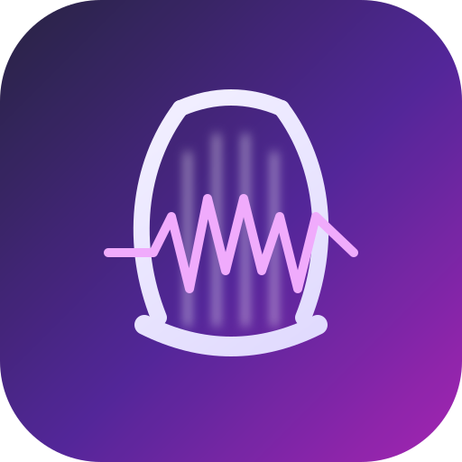

[!WARNING]
> This project is still in beta. Expect rough edges, missing polish, and the occasional broken workflow.

<p align="center">
  
  <br />
  <br />
  <a href="https://github.com/AlanRoybal/lyria-studio/releases">
    
  </a>
  &nbsp;
  <a href="https://github.com/AlanRoybal/lyria-studio/issues">
    
  </a>
</p>

# <p align="center">Lyria Studio</p>

<p align="center"><strong>Lyria Studio is a node-based desktop music IDE powered by Google Lyria Realtime.</strong></p>

If you want a fast way to sketch, direct, capture, arrange, and export AI-generated music without living in prompts alone, this is the idea. Lyria Studio gives you a graph editor for shaping generation, a timeline for arranging clips, and live tools for grabbing instrumentals and vocals into a song structure.

This is not trying to be a full DAW, and it is not pretending to replace one. It is a focused desktop tool for steering Lyria, experimenting quickly, and turning generations into something editable instead of disposable.

Lyria Studio is open source and built as a local Electron app. You bring your own Gemini API key, connect nodes, go live, capture what works, and export the result.

## Core Features
- Node-based graph editor with `Prompt`, `Instrument`, `Vocals`, and `Output` nodes.
- Weighted connections so prompts can influence the mix with adjustable strength.
- Live music generation powered by Google Lyria Realtime.
- Separate vocals generation flow for lyrics and voice-direction prompts.
- Built-in timeline with multiple tracks, clips, playhead control, and split editing.
- Clip automation lanes for volume and pitch.
- Live instrumental capture directly onto the timeline.
- One-click vocals clip capture into the active track.
- Mix export to WAV or compressed audio formats when supported by the runtime.
- Local API key persistence so you do not need to paste it every launch.

## Installation

### Run from source

Clone the repo, install dependencies, and start the desktop app:

```bash
git clone https://github.com/AlanRoybal/lyria-studio.git
cd lyria-studio
npm install
npm run dev
```

### Build production bundles

```bash
npm run build
```

### Create installers

```bash
npm run dist
```

Platform-specific packaging commands are also available:

```bash
npm run dist:mac
npm run dist:win
npm run dist:linux
```

## Getting Started
1. Generate a Gemini API key from [Google AI Studio](https://aistudio.google.com/).
2. Launch Lyria Studio and paste the key into the toolbar.
3. Build a graph such as `Prompt -> Instrument -> Output` or `Vocals -> Output`.
4. Set the BPM, press `GO LIVE`, and let the session start streaming.
5. Capture instrumentals or vocals into the timeline.
6. Arrange clips, tweak automation, and export the song.

## Notes And Limitations
- You need your own Google Gemini API key to use generation features.
- This project currently targets Google Lyria preview models, so upstream API behavior may change.
- Compressed export availability depends on codec support exposed by the runtime on your machine.
- The app stores your API key locally in the Electron user-data directory.
- Some workflows are still intentionally minimal and closer to a creative prototype than a finished production tool.

## Built With
- Electron
- React
- TypeScript
- Vite
- Tailwind CSS
- Zustand
- XY Flow
- Google GenAI SDK

---

_If something is broken or confusing, open an issue. That is currently the feedback loop._

## Contributing

Contributions are welcome. If you want to help, open an issue, propose a feature, or send a PR with a focused change.

## License

No license file is currently included in this repository.
